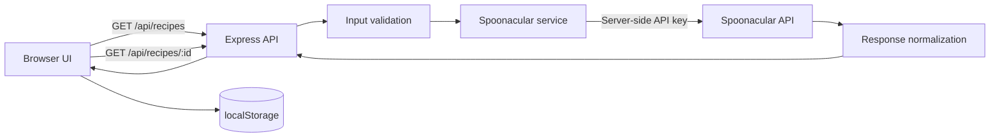

# Kitchen Wizard

Kitchen Wizard is an ingredient-first recipe discovery application. Add what you already have at home, compare recipe matches, see exactly which ingredients are available or missing, and open full cooking instructions without leaving the application.

The project began as a single HTML prototype and evolved into a secure, tested client-server application with a vanilla JavaScript frontend and an Express backend.

## Highlights

- Build searches with removable ingredient chips.
- See a match percentage and an accurate “Uses X of your Y ingredients” badge.
- View used and missing ingredients with pictures.
- Sort recipes by match quality, missing extras, ingredients used, or title.
- Filter out recipes that require too many additional ingredients.
- Open ingredients, timing, servings, diets, and instructions in an accessible modal.
- Save favorite recipes and recent searches in browser storage.
- Share recipes through the native share sheet or copy them to the clipboard.
- Follow clear loading, success, empty, and error states.
- Use the responsive interface with keyboard navigation and reduced-motion support.

## Technology

| Area | Technology |
| --- | --- |
| Frontend | Semantic HTML5, modern CSS, vanilla JavaScript |
| Backend | Node.js and Express 5 |
| External data | Spoonacular Recipe and Food API |
| Persistence | Browser `localStorage` for favorites and recent searches |
| Testing | Built-in Node.js test runner and strict assertions |
| Security | Server-side API proxy, input validation, response normalization, and safe DOM rendering |

## Architecture



Express serves the static frontend and the protected API from the same origin. The browser never receives the Spoonacular key. Search and detail responses are reduced to the fields the interface needs before they cross the backend boundary.

## Project structure

```text
Kitchen-Wizard/
├── public/
│   ├── index.html              # Semantic application shell
│   ├── styles.css              # Responsive visual system and states
│   └── app.js                  # UI state, rendering, storage, and requests
├── server/
│   ├── app.js                  # Express setup and static file serving
│   ├── routes/
│   │   └── recipes.js          # Search and recipe-detail routes
│   ├── services/
│   │   └── spoonacular.js      # Private API integration and normalization
│   └── validation/
│       └── ingredients.js      # Server-side ingredient rules
├── test/
│   ├── ingredients.test.js
│   ├── server.test.js
│   └── spoonacular.test.js
├── .env.example
├── package.json
└── README.md
```

## Getting started

### Prerequisites

- Node.js 20.6 or newer
- npm
- A [Spoonacular API](https://spoonacular.com/food-api) key

### Installation

1. Clone the repository and enter the project directory:

   ```bash
   git clone https://github.com/Fedi-1/Kitchen-Wizard.git
   cd Kitchen-Wizard
   ```

2. Install dependencies:

   ```bash
   npm install
   ```

3. Create your local environment file.

   PowerShell:

   ```powershell
   Copy-Item .env.example .env
   ```

   macOS or Linux:

   ```bash
   cp .env.example .env
   ```

4. Put your private key in `.env`:

   ```env
   SPOONACULAR_API_KEY=replace_with_your_key
   PORT=3000
   ```

5. Start the application:

   ```bash
   npm start
   ```

6. Open [http://localhost:3000](http://localhost:3000).

Do not open `public/index.html` directly. The browser application expects the Express API at `/api/recipes`.

## Using the application

1. Type an ingredient and press Enter or comma to create a chip.
2. Add up to 15 unique ingredients.
3. Select **Find Recipes**.
4. Sort or filter the result cards as needed.
5. Save, share, or open a recipe for complete details.
6. Reuse a previous ingredient combination from **Recent searches**.

Favorites and recent searches are stored only in the current browser. No account or database is required.

## API endpoints

### Search recipes

```http
GET /api/recipes?ingredients=tomato,basil,cheese
```

The response contains normalized recipe summaries, matched and missing ingredient details, and match information.

```json
{
  "recipes": [
    {
      "id": 123,
      "title": "Tomato Basil Pasta",
      "matchPercentage": 67,
      "matchedIngredientCount": 2,
      "requestedIngredientCount": 3,
      "missedIngredientCount": 1,
      "usedIngredients": [],
      "missedIngredients": []
    }
  ]
}
```

### Get recipe details

```http
GET /api/recipes/123
```

The response contains the normalized title, image, servings, preparation time, ingredients, dietary labels, instructions, and source name.

### Error format

All expected failures use the same shape:

```json
{
  "error": {
    "code": "INVALID_INGREDIENTS",
    "message": "Enter at least one ingredient."
  }
}
```

## Security and resilience

- The Spoonacular key exists only in the server environment.
- `.env` and runtime logs are excluded from version control.
- Ingredient input is validated on both the client and server.
- Query strings are built with `URLSearchParams`.
- External requests have an eight-second timeout.
- Provider responses are allow-listed and normalized before reaching the browser.
- External strings are rendered with DOM APIs and `textContent`, not `innerHTML`.
- Image addresses are restricted to trusted HTTPS Spoonacular hosts.
- Previous requests are cancelled to prevent overlapping result updates.
- Upstream authentication, quotas, timeouts, and provider failures map to predictable HTTP responses.

If an API key has ever appeared in client-side code or a public commit, revoke it and create a new one. Removing the text alone does not make an exposed key safe again.

## Accessibility

- Semantic form, main, section, article, and heading structure
- Visible labels and keyboard focus indicators
- Live regions for loading, success, empty, and error announcements
- Native accessible dialog behavior for recipe details
- Keyboard-operable chips, controls, favorite buttons, and sharing
- Reduced animation when `prefers-reduced-motion` is enabled

## Commands

| Command | Purpose |
| --- | --- |
| `npm start` | Start the production-style local server |
| `npm run dev` | Start the server in Node watch mode |
| `npm run check` | Check all JavaScript files for syntax errors |
| `npm test` | Run the automated test suite |

## Testing

The automated suite currently covers:

- Trimming, deduplication, length limits, and ingredient-count limits
- Static application delivery and API route validation
- Missing server configuration
- Search response normalization and match calculations
- Recipe-detail normalization
- Conversion of provider HTML to safe plain text

Run all tests:

```bash
npm test
```

Run syntax validation:

```bash
npm run check
```

## Current limitations

- Recipe availability and instruction quality depend on Spoonacular data.
- Searches and detail requests consume Spoonacular quota points.
- Favorites and history are local to one browser and are not synchronized.
- The application does not currently include accounts, a database, or offline support.

## Possible next steps

- Deploy the server and add a public demo URL.
- Add nutrition information and dietary filters.
- Add end-to-end browser tests.
- Add a service worker and installable PWA experience.
- Synchronize favorites through optional user accounts.

## Acknowledgements

Recipe data is provided by the [Spoonacular Recipe and Food API](https://spoonacular.com/food-api).
